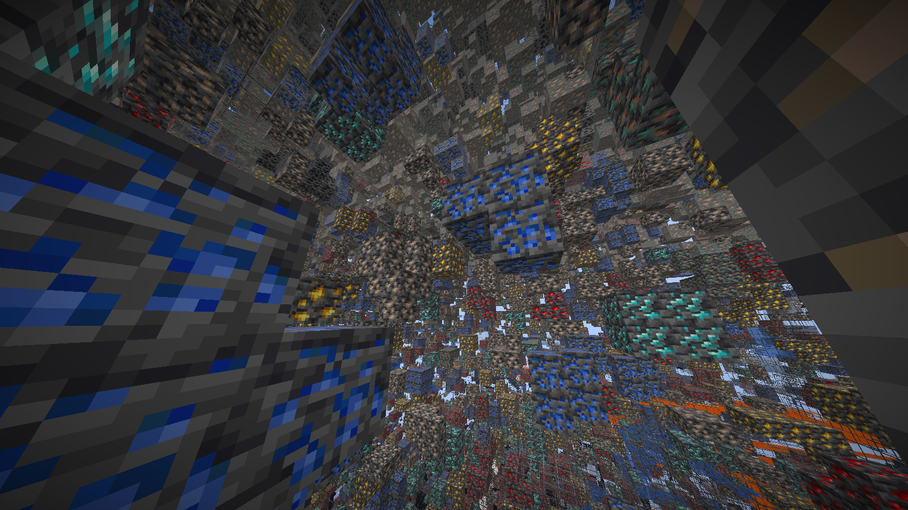
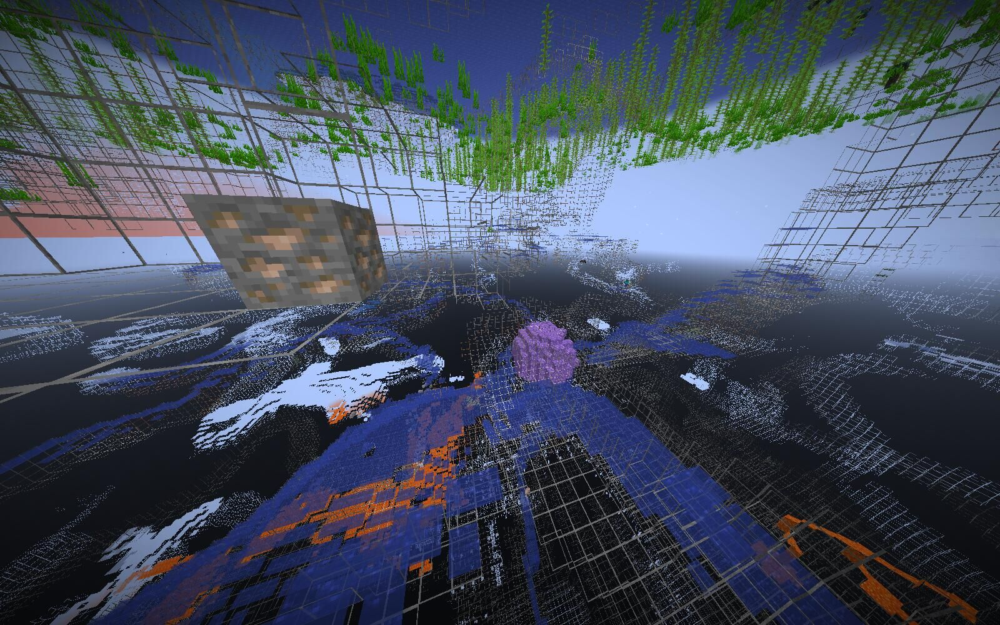
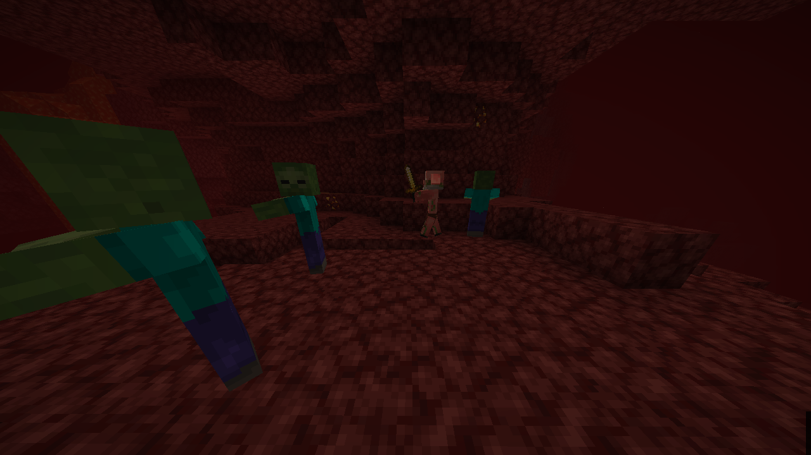

# Biome-Modifier-for-Fabric


## Abstract

This is a library mod that allows users utilize datapacks to modify biomes, dimensions and noise generators easily and compatibly.

## Usage for Developers

We all know that for Forge modpacks, developers can utilize the following [example](https://github.com/Viola-Siemens/EmeraldCraftMod/blob/Forge-1.20.1_9.1.X/src/main/resources/data/emeraldcraft/forge/biome_modifier/ec_wild_crops.json) to modify biomes:

```json
{
  "type": "forge:add_features",
  "biomes": "#forge:is_plains",
  "features": [
    "emeraldcraft:wild_cabbage",
    "emeraldcraft:wild_chili"
  ],
  "step": "vegetal_decoration"
}
```

Let's make this work for Fabric!

Datapack developers should put all biome modifiers (with format `*.json`) on `data/<modid>/biome_modifiers/` directory. With this mod, all biome modifiers will be applied on each biome.

Same will also happen on dimensions (`data/<modid>/dimension_modifiers/`) and noise generators (`data/<modid>/noise_generator_modifiers/`).

All [biome / dimension / noise] generator modifiers should follow this format:

```json
{
  "type": "<modifier type>",
  "biomes": "<registry name of a single biome/list of registry names of biomes/a tag of biomes>",
  "priority": priority,
  "<other keys...>": "<other values...>"
}
```
```json
{
"type": "<modifier type>",
"dimension_types": "<registry name of a single dimension/list of registry names of dimensions/a tag of dimensions>",
"priority": priority,
"<other keys...>": "<other values...>"
}
```
```json
{
"type": "<modifier type>",
"noise_settings": "<registry name of a single noise generator/list of registry names of noise generators/a tag of noise generators>",
"priority": priority,
"<other keys...>": "<other values...>"
}
```

Where `type` stands for the type of [biome / dimension / noise generator] modifiers, and [`biomes` / `dimension_types` / `noise_settings`] stands for all [biomes / dimensions / noise generators] to be modified.

Notice that `priority` field is optional. The smaller it is, the earlier it will be applied to the biomes (for example, modifiers with priority 99 will be applied earlier than modifiers with priority 100). The default value is 1000.

### Different Types of Biome Modifiers

We provide 18 different types of biome modifiers:

#### none

This type allows developers to replace other biome modifiers in other datapacks.

```json
{
  "type": "biome_modifier:none"
}
```

#### add_features

This biome modifier adds all placed features mentioned in `features` field to target biomes.

If any placed feature is missing from the registry, an error will be logged (won't crash the game with safe mode).

```json
{
  "type": "biome_modifier:add_features",
  "biomes": "<registry name(s) of biomes>",
  "features": "<registry name of a single feature/list of registry names of features>",
  "step": "<step of decoration generation>"
}
```

#### remove_features

This biome modifier removes all placed features mentioned in `features` field from target biomes.

If any placed feature is missing from the target biomes, a warning will be logged and won't crash the game.

If any placed feature is missing from the registry, an error will be logged (won't crash the game with safe mode).

```json
{
  "type": "biome_modifier:remove_features",
  "biomes": "<registry name(s) of biomes>",
  "features": "<registry name of a single feature/list of registry names of features>",
  "step": "<step of decoration generation>"
}
```

#### add_spawns

This biome modifier adds all entity spawns mentioned in `spawns` field to target biomes.

If any entity type is missing from the registry, an error will be logged (won't crash the game with safe mode).

```json
{
  "type": "biome_modifier:add_spawns",
  "biomes": "<registry name(s) of biomes>",
  "spawners": [
    {
      "type": "<registry name of a single entity type>",
      "weight": weight,
      "minCount": minCount,
      "maxCount": maxCount
    }
    //If you only add one spawner, you can also replace the list with the only object.
  ]
}
```

#### remove_spawns

This biome modifier removes all entity spawns mentioned in `entity_types` field from target biomes.

If any entity type is missing from the target biomes, a warning will be logged and won't crash the game.

If any entity type is missing from the registry, an error will be logged (won't crash the game with safe mode).

```json
{
  "type": "biome_modifier:remove_spawns",
  "biomes": "<registry name(s) of biomes>",
  "entity_types": [
    "<registry name of a single entity type>"
    //If you only remove one spawner, you can also replace the list with the only string.
  ]
}
```

#### add_spawn_costs

This biome modifier adds all entity spawns mentioned in `spawn_costs` field to target biomes.

Unlikely to `biome_modifier:add_spawns`, this modifier adds spawns to spawn costs (aka. spawn potential, spawn density).

If any entity type is missing from the registry, an error will be logged (won't crash the game with safe mode).

```json
{
  "type": "biome_modifier:add_spawn_costs",
  "biomes": "<registry name(s) of biomes>",
  "spawn_costs": {
    "<registry name of a single entity type>": {
      "charge": charge,
      "energy_budget": energy_budget
    }
  }
}
```

#### remove_spawn_costs

This biome modifier removes all entity spawns mentioned in `entity_types` field from target biomes.

Unlikely to `biome_modifier:remove_spawns`, this modifier removes spawns to spawn costs (aka. spawn potential, spawn density).

If any entity type is missing from the target biomes, a warning will be logged and won't crash the game.

If any entity type is missing from the registry, an error will be logged (won't crash the game with safe mode).

```json
{
  "type": "biome_modifier:remove_spawn_costs",
  "biomes": "<registry name(s) of biomes>",
  "entity_types": [
    "<registry name of a single entity type>"
    //If you only remove one spawner, you can also replace the list with the only string.
  ]
}
```

#### add_carvers

This biome modifier adds all carvers mentioned in `carvers` field to target biomes.

If any carver is missing from the registry, an error will be logged (won't crash the game with safe mode).

```json
{
  "type": "biome_modifier:add_carvers",
  "biomes": "<registry name(s) of biomes>",
  "carvers": "<registry name of a single carver/list of registry names of carvers>",
  "step": "<step of carver generation>"
}
```

#### remove_carvers

This biome modifier removes all carvers mentioned in `carvers` field from target biomes.

If any carver is missing from the target biomes, a warning will be logged and won't crash the game.

If any carver is missing from the registry, an error will be logged (won't crash the game with safe mode).

```json
{
  "type": "biome_modifier:remove_carvers",
  "biomes": "<registry name(s) of biomes>",
  "carvers": "<registry name of a single carver/list of registry names of carvers>",
  "step": "<step of carver generation>"
}
```

#### creature_spawn_probability

This biome modifier changes probability of creature spawn from target biomes.

`creature_spawn_probability` should be a float value between 0 (inclusive) and 1 (exclusive).

```json
{
  "type": "biome_modifier:creature_spawn_probability",
  "biomes": "<registry name(s) of biomes>",
  "creature_spawn_probability": probability
}
```

#### downfall

This biome modifier changes downfall of target biomes, which only affects grass and foliage color.

`downfall` should be a float value.

```json
{
  "type": "biome_modifier:downfall",
  "biomes": "<registry name(s) of biomes>",
  "downfall": downfall
}
```

#### temperature

This biome modifier changes temperature of target biomes, which only affects grass and foliage color.

`temperature` should be a float value.

```json
{
  "type": "biome_modifier:temperature",
  "biomes": "<registry name(s) of biomes>",
  "temperature": temperature
}
```

#### precipitation

This biome modifier changes whether target biomes has precipitation or not.

`has_precipitation` should be a boolean value.

```json
{
  "type": "biome_modifier:precipitation",
  "biomes": "<registry name(s) of biomes>",
  "has_precipitation": has_precipitation
}
```

#### fog_color & sky_color & water_color & water_fog_color

This biome modifier changes whether target biomes has precipitation or not.

`color` should be an integer value between 0 (inclusive) and 16777216 (exclusive), or an object like `{"r": r, "g": g, "b", b}`, where `r` and `g` and `b` are integers between 0 (inclusive) and 256 (exclusive).

```json
{
  "type": "biome_modifier:[fog_color/sky_color/water_color/water_fog_color]",
  "biomes": "<registry name(s) of biomes>",
  "color": color
}
```

#### temperature_adjustment

This biome modifier changes whether target biomes has precipitation or not.

`color` should be an integer value between 0 (inclusive) and 16777216 (exclusive), or an object like `{"r": r, "g": g, "b", b}`, where `r` and `g` and `b` are integers between 0 (inclusive) and 256 (exclusive).

```json
{
  "type": "biome_modifier:temperature_adjustment",
  "biomes": "<registry name(s) of biomes>",
  "temperature_modifier": "[none/frozen]"
}
```

### Different Types of Dimension Modifiers

We provide 19 different types of biome modifiers:

#### none

This type allows developers to replace other dimension modifiers in other datapacks.

```json
{
  "type": "biome_modifier:none"
}
```

#### fixed_time

This dimension modifier changes fixed time from target dimensions.

`fixed_time` is an optional long value. If absent, the dimensions will do daylight cycle and remove its fixed time. If present, time is fixed in those dimensions.

```json
{
  "type": "biome_modifier:fixed_time",
  "dimensions": "<registry name(s) of dimensions>",
  "fixed_time": fixed_time  //optional
}
```

#### sky_light

This dimension modifier changes if target dimensions has sky light.

`has_skylight` should be a boolean value.

```json
{
  "type": "biome_modifier:sky_light",
  "dimensions": "<registry name(s) of dimensions>",
  "has_skylight": has_skylight
}
```

#### ceiling

This dimension modifier changes if target dimensions has ceiling.

`has_ceiling` should be a boolean value.

```json
{
  "type": "biome_modifier:ceiling",
  "dimensions": "<registry name(s) of dimensions>",
  "has_ceiling": has_ceiling
}
```

#### ultra_warm

This dimension modifier changes if target dimensions is ultra warm.

`ultrawarm` should be a boolean value.

```json
{
  "type": "biome_modifier:ultra_warm",
  "dimensions": "<registry name(s) of dimensions>",
  "ultrawarm": ultrawarm
}
```

#### natural

This dimension modifier changes if target dimensions is natural.

`natural` should be a boolean value.

```json
{
  "type": "biome_modifier:natural",
  "dimensions": "<registry name(s) of dimensions>",
  "natural": natural
}
```

#### coordinate_scale

This dimension modifier changes coordinate scale from target dimensions.

`coordinate_scale` should be a double float value between 1.0E-5 and 3.0E+7.

```json
{
  "type": "biome_modifier:coordinate_scale",
  "dimensions": "<registry name(s) of dimensions>",
  "coordinate_scale": coordinate_scale
}
```

#### bed_works

This dimension modifier changes if bed can work in target dimensions.

`bed_works` should be a boolean value.

```json
{
  "type": "biome_modifier:bed_works",
  "dimensions": "<registry name(s) of dimensions>",
  "bed_works": bed_works
}
```

#### respawn_anchor_works

This dimension modifier changes if respawn anchor can work in target dimensions.

`respawn_anchor_works` should be a boolean value.

```json
{
  "type": "biome_modifier:respawn_anchor_works",
  "dimensions": "<registry name(s) of dimensions>",
  "respawn_anchor_works": respawn_anchor_works
}
```

#### min_y

This dimension modifier changes the min Y of target dimensions.

`min_y` should be an integer value.

```json
{
  "type": "biome_modifier:min_y",
  "dimensions": "<registry name(s) of dimensions>",
  "min_y": min_y
}
```

#### height

This dimension modifier changes the height of target dimensions.

`height` should be an integer value.

```json
{
  "type": "biome_modifier:height",
  "dimensions": "<registry name(s) of dimensions>",
  "height": height
}
```

#### logical_height

This dimension modifier changes the logical height of target dimensions.

`logical_height` should be an integer value.

```json
{
  "type": "biome_modifier:logical_height",
  "dimensions": "<registry name(s) of dimensions>",
  "logical_height": logical_height
}
```

#### infiniburn

This dimension modifier changes which tag of blocks will burn infinitely in target dimensions.

```json
{
  "type": "biome_modifier:infiniburn",
  "dimensions": "<registry name(s) of dimensions>",
  "infiniburn": "<a tag of blocks>"
}
```

#### effects

This dimension modifier changes effects of target dimensions.

`effects` should be a resource location.

```json
{
  "type": "biome_modifier:effects",
  "dimensions": "<registry name(s) of dimensions>",
  "effects": "<an id of effects>"
}
```

#### ambient_light

This dimension modifier changes the level of ambient light of target dimensions.

`ambient_light` should be a float value.

```json
{
  "type": "biome_modifier:ambient_light",
  "dimensions": "<registry name(s) of dimensions>",
  "ambient_light": ambient_light
}
```

#### piglin_safe

This dimension modifier changes if piglins are safe and won't zombify in target dimensions.

`piglin_safe` should be a boolean value.

```json
{
  "type": "biome_modifier:piglin_safe",
  "dimensions": "<registry name(s) of dimensions>",
  "piglin_safe": piglin_safe
}
```

#### raids

This dimension modifier changes if raids can occur in target dimensions.

`has_raids` should be a boolean value.

```json
{
  "type": "biome_modifier:raids",
  "dimensions": "<registry name(s) of dimensions>",
  "has_raids": has_raids
}
```

#### monster_spawn_light

This dimension modifier changes the minimum light level to spawn monsters from target dimensions.

`monster_spawn_light_level` should be an integer value between 0 (inclusive) and 16 (exclusive).

```json
{
  "type": "biome_modifier:monster_spawn_light",
  "dimensions": "<registry name(s) of dimensions>",
  "monster_spawn_light_level": monster_spawn_light_level
}
```

#### monster_spawn_block_light_limit

This dimension modifier changes the maximum block light level to spawn monsters from target dimensions.

`monster_spawn_block_light_limit` should be an integer value between 0 (inclusive) and 16 (exclusive).

```json
{
  "type": "biome_modifier:monster_spawn_block_light_limit",
  "dimensions": "<registry name(s) of dimensions>",
  "monster_spawn_block_light_limit": monster_spawn_block_light_limit
}
```

### Different Types of Noise Generator Modifiers

We provide 6 different types of noise generator modifiers currently:

#### none

This type allows developers to replace other noise generator modifiers in other datapacks.

```json
{
  "type": "biome_modifier:none"
}
```

#### default_block

#### default_fluid

#### sea_level

#### aquifers

#### ore_veins

## Examples

We provide 4 example datapacks for our mods:

### Extra Ores

This datapack adds extra ore blocks to the overworld.



### No Ore in Overworld

This datapack removes all ore blocks to the overworld, and only keeps ore veins for players to obtain ores.



### Zombies in the Nether

This datapack makes zombie able to spawn in the nether.



### Always Working Bed

This datapack removes "Intentional Game Design" from the nether and the end.